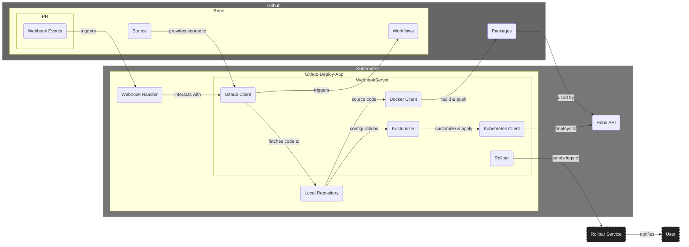
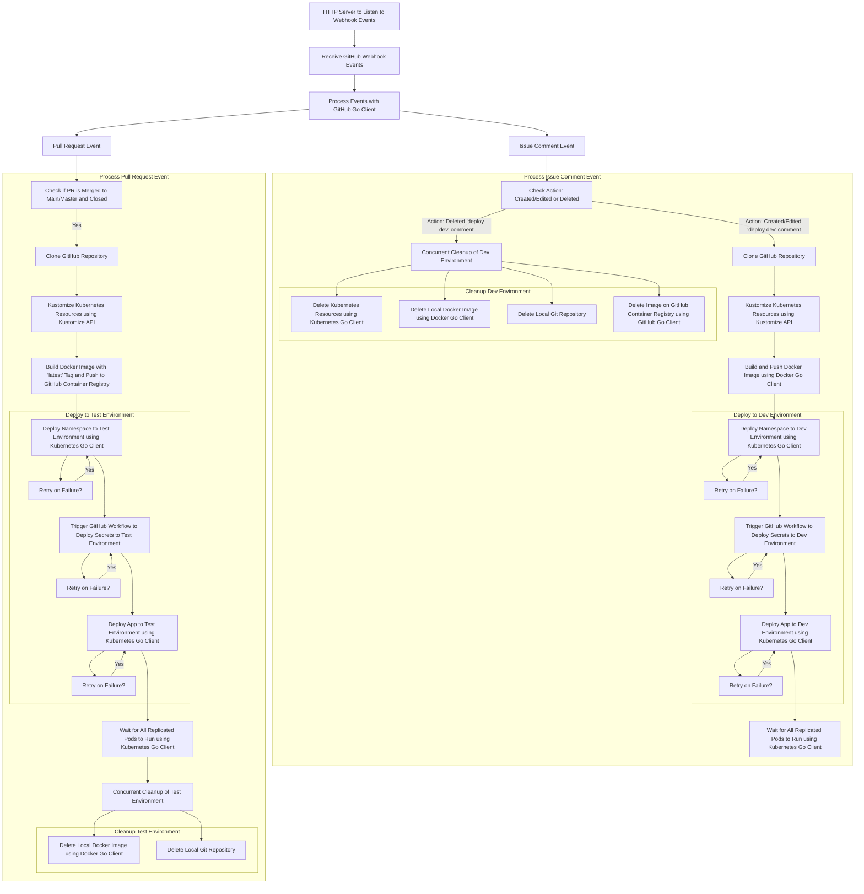

# hono-kube-deploy-automation
[](https://github.com/uib-ub/hono-kube-deploy-automation/actions/workflows/cicd.yaml) [](https://codecov.io/gh/uib-ub/hono-kube-deploy-automation)


## Table of Contents

- [Overview](#Overview)
- [Features](#Features)
- [Architecture Overview](#Architecture-overview)
- [Workflow Diagram](#Workflow-diagram)
- [Webook Settings](#Webook-settings)
- [Webhook Events](#webhook-events)
- [Configuration and Secrets](#Configuration-and-secrets)
- [Local Development with Docker Compose](#local-development-with-docker-compose)
- [Testing and Code Coverage](#testing-and-code-coverage)
- [Rollbar Integration for Error Tracking](#rollbar-integration-for-error-tracking)
- [Kubernetes Deployment](#Kubernetes-deployment)
- [Health Checks](#health-checks)

## Overview

This Go application is designed to automate the deployment of the `hono-api` to a Kubernetes cluster. It integrates with Go clients including GitHub, Docker, Kustomize, and Kubernetes to handle the deployment processes triggered by specific GitHub webhook events. The application listens for specific GitHub webhook events and triggers actions such as building Docker images, deploying Kubernetes resources, and managing workflows and package images. This go implementation uses the code style following the [Google Golong Style Guide](https://go.dev/wiki/CodeReviewComments).

## Features

- Automates deployment of the `hono-api` to Kubernetes clusters.
- Listens to GitHub webhook events for pull requests and issue comments.
- Supports building, pushing, and deleting Docker images locally and container registry.
- Utilizes Kustomize to build Kubernetes configuration resources.
- Deploys Kubernetes resources using the Kubernetes Go client.
- Integrates with Rollbar for error monitoring and logging.

## Architecture Overview


## Workflow Diagram


## Domain

The domain for the application is `api-git-deploy.testdu.uib.no` which is created on NREC and defined and used in Ingress of kubernetes deployment.

## Webhook Settings

- Go to `Webhooks` under repository `Settings`, and click `Add webhook`.
- Add `https://api-git-deploy.testdu.uib.no/webhook` under `Payload URL`, and `application/json` under `Content type`.
- Give a Secret, which will be used in for webhook server to recieve webhook events.
- Select `Let me select individual events.`, then choose `Pull requests` and `Issue commits`.
- Click `Add webhook`.

## Webhook Events
The application handles the following GitHub webhook events:

a. Issue Comment Event: 

Deploy to the development environment when a comment `deploy dev` is created or deleted in a pull request.

b. Pull Request Event: 

Deploy to the test environment when a pull request labeled `type: deploy-test-hono` is merged into the main branch.

## Configuration and Secrets

The application requires configuration and secret settings.
Configuration can be loaded from a file (`config.yaml`) 
The secrets are handled by Github repository secrets and used in the Github workflow (`cicd.yaml`) job `deploy-secrets`. 

Key secrets:

- GitHub:
  - `GitHubToken`: GitHub personal access token for authentication.
  - `WebhookSecret`: Secret for verifying GitHub webhook payloads.

- Rollbar:
  - `RollbarToken`: Token for Rollbar error logging.

Key configuration in `config.yml`:

- Github:
  - `workflowPrefix`: the prefix of the GitHub workflow name to deploy secrets to Kubernetes, such as "deploy-kube-secrets"
  - `localRep`: The local repository location, such as "app"
  - `packageType`: the GitHub package type, which is "container"
  - `prDeployLabel`: label "deploy-test-hono" is used in PR to indicate the deployment to test environment

- Kubernetes:
  - `KubeConfig`: Path to the local kubeconfig file, if we run this Go application outside of the Kubernetes cluster.
  - `DevNamespace`: Kubernetes namespace for the development environment.
  - `TestNamespace`: Kubernetes namespace for the test environment.
  - `Resource`: Path to Kubernetes resource configuration directory ("microk8s-hono-api" for hono api).

- Container:
  - `Dockerfile`: Dockerfile file name.
  - `Registry`: container registry to push Docker images.
  - `ImageSuffix`: Suffix to append to Docker images.

## Local Development with Docker Compose

For local development, you can use the docker-compose.yaml file to build and run the application with ease. The docker-compose setup uses environment variables defined in the .env-template file. To get started:

1. Copy the .env-template to .env and configure the required environment variables

```
WEBHOOK_SECRET=test-secret
GITHUB_TOKEN=test-github-access-token
ROLLBAR_TOKEN=test-rollbar-token
MY_KUBECONFIG=/local-path-to/.kube/config
KUBECONFIG=/root/.kube/config
DOCKER_HOST=unix:///var/run/docker.sock
```

2. Run the application using Docker Compose:

```
docker-compose -f docker-compose.yaml up --build -d
```

for stop the application:

```
docker-compose -f docker-compose.yaml up down
```

3. use a tool such as [ngrok](https://ngrok.com/)

For example, run the following command:
```
ngrok http 8080
```

We get HTTP Endpoint:
```
Forwarding https://xxx.ngrok-free.app -> http://localhost:8080 
```

4. Copy `https://xxx.ngrok-free.app` to the GitHub webhook settings:
 - for the Payload URL, we give: "https://xxx.ngrok-free.app/webhook"
 - Content type: "application/json"
 - create a webhook secret and use it in the CICD workflow
 - Choose "Let me select individual events" and select "Issue comments" and "Pull requests"


## Testing and Code Coverage

All Go client code (github.go, docker.go, kubernetes.go, and kustomize.go) is thoroughly tested with unit tests to ensure reliability. Code coverage is maintained using [Codecov](https://app.codecov.io/gh/uib-ub/hono-kube-deploy-automation), integrated via GitHub Actions to provide insights on test coverage.

## Rollbar Integration for Error Tracking

[Rollbar](https://rollbar.com/) is integrated into the application to monitor and track errors and log messages. This integration helps in identifying and resolving issues quickly by providing real-time insights into the application's behavior.

## Kubernetes Deployment 

Deployment is managed via a GitHub Actions CI/CD pipeline defined in CICD.yaml. This workflow automates testing, building, pushing Docker images, and deploying the application to a Kubernetes cluster.

- Kubernetes YAML configuration (`deploy.yaml`) resources:
  1. `Deployment`: this object decleares the manifest as a `Deployment` to manage the application pods.
  2. `Service`: this object enables communication with the pod, and we use `ClusterIP` to expose the application internally within the cluster. It listen on port 80 (HTTP) and forward traffic to port 8080 on the pod. This Service is named `github-deploy-hono`.
  3. `Ingress`: this object exposes the application to external traffic. It routes external traffic from `api-git-deploy.testdu.uib.no` to the `Service` `github-deploy-hono` on port 80. This `Ingress` uses `cert-manager` for TLS certificate provisioning with Let's Encrypt.
  4. `ServiceAccount`: this object defines a service account for the deployment, and it is named as `github-deploy-hono`.
  5. `ClusterRole`: this object defines permissions for accessing Kubernetes resources, and `github-deploy-hono` is the role name. It grants permissions to access namespaces and all resources across all API groups
  6. `ClusterRoleBinding`: this object binds the `github-deploy-hono` `ClusterRole` to the service account `github-deploy-hono`.

There resources defined in `deploy.yaml` file set up a Kubernetes deployment for the github-deploy-hono application using a service account having permissions to manage kubernetes resources, such as "get", "list", "watch", "create", "update", "patch", and "delete".

## Health Checks

The application provides two health check endpoints:

* Liveness Probe: `GET /health` - Always returns 200 OK to indicate the application is alive.

* Readiness Probe: `GET /ready` - Returns 200 OK if the application is ready to handle requests, otherwise returns 503 Service Unavailable.
